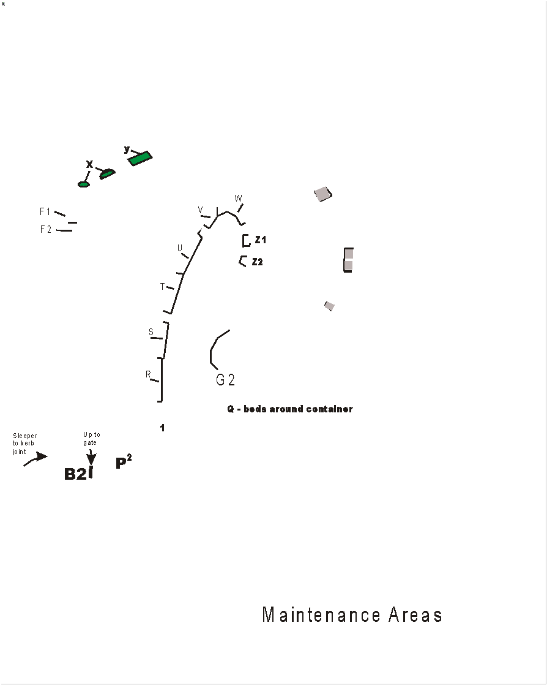
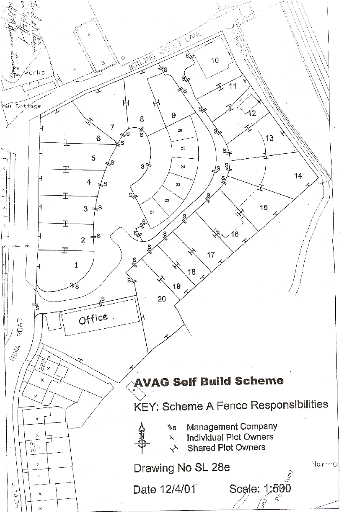
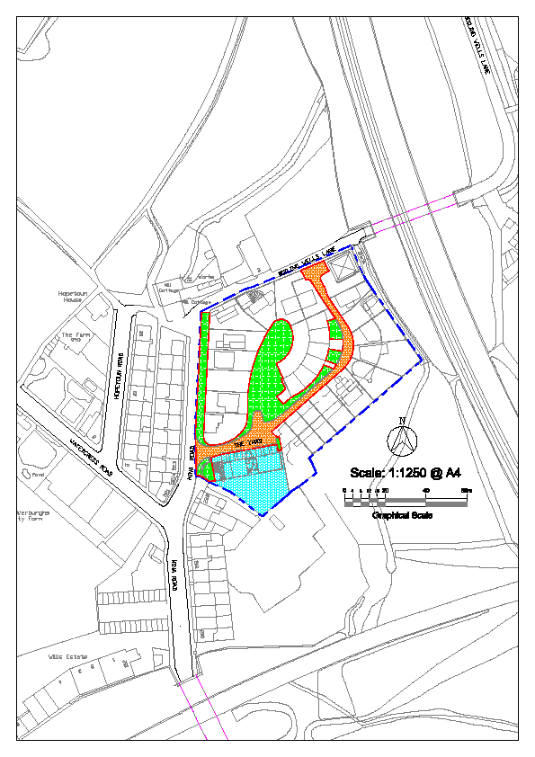

<!--more--> 

## About The Yard

In 1999 The Yard was a disused scaffolding yard up for sale for development. A commercial developer had planned to build a typical housing estate on it. A group of neighbours formed Ashley Vale Action Group (AVAG) to protest these plans. It was a unique neighbourhood, and people didn’t want an identikit housing development built solely to profit a development company. The group successfully stopped the plans, and then decided to develop the site themselves with plots for self-build houses, and communal gardens, workshops and a community room for the neighbourhood. The Yard is the result of the passion and determination of many people; those original visionaries who believed that a community-led development could work, and the self-builders and neighbours who made it happen.

If you want to know more there is a book, *The Story of the Yard; Building a Community *by Carrie Hitchcock, available from the Ecomotive office, (middle workshop next to the Wild Gooses Space Community Room,) Better Food, or from Carrie (see Personnel p 3).

### The Management Company

_The Mina Road (Bristol) Estate Management Company Ltd._ exists to administrate and execute the responsibilities connected with the collectively owned areas of the estate. All property owners on the estate signed a contract at point of sale agreeing to be a member of this Company, and to pay service charges towards the maintenance of site infrastructure and communal gardens. This booklet will explain some of the background of the Company and your rights and responsibilities as a member.

### Personnel

Company Directors for 2021-2022 are: John Tolson, Carrie Hitchcock, Sue Tate, Jon Brockwell, Joe Jarlett and Trish Calvert. Company administrator is Carrie Hitchcock, 244 Mina Rd, Tel: 0117 924 3076, [e.m.c.yard@gmail.com](mailto:e.m.c.yard@gmail.com). Please contact Carrie with any queries, concerns, suggestions, items for agenda, etc., or if you would like a copy of the Company’s ‘Mems and Arts’, or the TP1 you signed at sale.

We have regular, advertised open meetings and welcome new directors and anyone who wants to be involved in developing and maintaining this community.

## Ashley Vale Action Group (AVAG)

AVAG is a community action group whose current aim is to:

- Provide attractive, affordable work and leisure space for local residents to help sustain a strong sense of community, creative endeavour and enterprise within the neighbourhood of Ashley Vale (Wildgoose Space)
- Continue to support innovative and affordable housing design and options in Bristol
- Support and enable individuals and local group led community initiatives
- Use Wildgoose Space, to support local and community-based groups with affordable hire rates; and to run a programme of community enhancing and enriching events in the space
- Seek to provide leadership and stewardship of the local (Ashley Vale) natural environment – through awareness raising and other organised activities, such as local work parties

It is a completely separate organisation to the Estate Management Company.  AVAG pioneered the development of this estate, designed and managed the development of the Bungalows and the conversion of the Office Block. They currently own and manage three Workshops and Wild Goose Space Community Room on the ground floor of the office block.  For more information about AVAG or Wildgoose Space visit AVAG’s website, ashleyvale.org.uk or wildgoosespace.org.uk.

## Tenants

There is at least one Tenant Director on the board of the Management Company who has voting rights. This position is reviewed annually. We welcome interest and involvement from tenants living on the yard.  Please feel free to join in work parties, attend meetings, or contact us with suggestions and concerns.

## Shared Vision and Collective Values

Agreeing our **shared vision** and **collective values** for our community gives the Directors a framework in which to operate and informs decision-making.

> We want to create a socially diverse, mutually supportive, integrated community connected to the wider neighbourhood and caring for our environment.

### We have built and want to maintain a low impact, energy efficient community by

- Supporting organisations to lobby for, and showcase, community builds motivated by residents’ needs rather than company profits
- Encouraging sustainable building techniques and materials
- Acting responsibly with our waste and energy management
- Supporting sustainable transport initiatives and promoting public transport, cycling and walking access to the estate

### We aim to prioritise the quality of life for residents over the convenience of vehicles by

- Finding creative ways to restrict the speed of vehicles entering the neighbourhood
- Prioritising space for pedestrians and children playing
- Continuing to inform residents and landlords about considerate parking and vehicle restrictions as laid out in the TP1 and Handbook
- Support initiatives to improve safety on local roads

### We want to nurture the social health of the Yard by

- Communicating and co-operating with each other through online groups, socials, creative gatherings and work parties.
- Being welcoming and inclusive to new residents
- Supporting residents to participate in the maintenance, development and life of the Yard
- Encouraging ethical letting and selling

### We aspire to complement the organic environment of the valley, to continue to improve its ecology and diversity, and to endeavour not to act to its detriment by

- Supporting talks, meetings and skill and resource sharing around organic gardening, recycling, composting and encouraging wildlife
- Encouraging the use of environmentally friendly materials

### We want the estate to enhance the community of St. Werburghs and regard the community as a whole, and therefore consider the needs of our neighbours by
- Communicating and collaborating with local people and organisations, such as AVAG and the Farm as well as others in the wider community
- Continuing to support and maintain a local Neighbourhood Watch scheme

In order that we can achieve these aims, we ask that individuals involved in the Yard consider the values of the whole community in their individual actions.

## The Yard Decision Making Process

We want the Company to be organised so that **everyone can contribute**, so we will ensure that:

- Notice of all meetings and agenda are circulated 14 days in advance.
- All meetings are minuted and these minutes distributed
- All meetings are open to any Member to attend and propose agenda items

Decisions are made by Directors at regular Board Meetings and by all Members at General Meetings.

## Board meetings

- Company directors have power to make decisions on behalf of the Company. Quorum is four. In the case of a vote; one director=one vote
- Directors must be ‘*Members*’ *and be resident, elected at AGM or co-opted
- Chair to be agreed before each meeting and to devise agenda with administrator
- Only Directors have a vote at Board meetings, but all Yard residents are welcome to attend and speak
- Tenants can become Directors and have a vote at regular Board meetings
- Administrator is responsible for advertising meeting, taking and distributing minutes, keeping accurate financial records and providing a summary of these for each Board meeting
- Any member can propose an idea/action/expenditure to the Directors by using a **Proposal Form** available from the administrator at [e.m.c.yard@gmail.com](mailto:e.m.c.yard@gmail.com), or at the back of this Handbook.

## General meetings

- All Members have a vote at Annual General Meetings (AGMs, held in the Autumn) and Extra General Meetings (EGMs). Members can also vote by Proxy; in which case they will need to fill out a Proxy form available from the administrator. In the case of a vote; one dwelling=one vote. Tenants do not have votes at General meetings.
- If any Member isn’t happy with a board decision, or wants a wider vote for a proposal, a minimum of four Members can request an EGM.

## Expenditure

- Development projects requiring major expenditure to be detailed to members at least one meeting previous to said expenditure and require approval of 75% of members present or by proxy to ensure a mandate from membership.

> A ‘Member’ is someone who pays service charges, i.e a house owner

**If you would like to contribute to decision-making, please become a director. New Directors can be co-opted by the Board at any point in the year.**

## **Grievance Procedure**

Grievances must be submitted in writing to the EMC, either to the administrator, 228 Mina Rd, or to any of the directors.

EMC undertakes to respond after the next directors meeting (meetings are quarterly).  If the directors cannot settle the grievance, complainant can request a membership vote at EGM, one dwelling; one vote.

## Charges

### Service charges

Our financial year runs from Oct 1st to September 30th.  Service charges from Oct 1st, 2019 are £266.60 per annum, per dwelling.  The amount will be reviewed annually.  A dwelling is defined as a home that has its own separate kitchen, separate secure access, and is separated by a permanent physical barrier.

Charges are payable by the house owner only. We will not accept payments by tenants.

The service charge is designed to cover the maintenance and development of collectively owned areas of the Yard. It covers gardening, administration, public liability insurance, social event and meetings, and any other expenditure as decided by the Directors. Any unspent funds at the end of the year are designated as an infrastructure charge to accumulate in a 'sink fund' to cover repairs to the road and services infrastructure.

We prefer those payments be made by monthly standing order, and there is a 10% discount for those who pay by this method.  Otherwise you will be invoiced annually.  If you do not pay this invoice, or make arrangements to pay, by the specified date, you will receive a second invoice and a penalty charge will be levied.  If you do not pay, or make arrangements to pay, within six months of the original invoice we will begin legal proceedings to recover money owed.

In May 2009 at an EGM, Company members voted to institute a second class of membership for those who have not completed their buildings.  These members will be charged an increased service charge of £2000 per annum (subject to annual review) until their houses have been signed off by Building Regulations.  This fee reflects the extra work necessitated by the administrator and directors to forward the completion, and to provide a fund for the community to deal with the consequences of the failure to complete, such as infestation, degradation and in particular increased risk of fire that these unfinished buildings present.  This charge will be invoiced annually.  If unpaid the charge will accrue and be payable on transfer of the property.

### Transfer fees

The management Company will charge two types of transfer fees:

- a transfer resulting a change of occupancy will incur a charge £200 to reflect the admin time required to comply with various requirements
- any other dispensations (e.g. mortgage or re-mortgage) will incur only the minimum fee of £30

**It is the responsibility of the seller to ensure that the restriction is included on the title deed when transferring deeds, and to ensure that the buyer understands their obligations and responsibilities in respect of the Company.**

## **Living Together**

### Recycling centre

Contractors collect our rubbish for landfill (Black bins) weekly every Friday.

Recycling is collected weekly on a Thursday, and Garden Waste every alternate Monday.

The recycling centre is available for the use of all site dwellers, in practice however, those living on Mina Rd use the council’s usual collection facilities where collection day is Monday, landfill collection fortnightly, recycling weekly from outside house.

### Use the Facilities to keep the container clean, effective and SAFE

- **Landfill:** Obviously we are all trying to reduce this as much as possible by using the other facilities more. Please note there are currently 7 large bins for everyone.
- **Glass, Paper, Cans:** As marked! Crushed cans fill the bin up more slowly.......
- **Plastic:** Now collected with the cans. Plastic drinks bottles (PET Type 1) and plastic milk bottles (HDPE Type 2) **Please crush and refit lid to save space**. They also take domestic product bottles from kitchen & bathroom as well as ice-cream tubs, take away trays etc. **But NO hard plastic, black plastic, bin liners, bags, flowerpots, crisp wrappers, bubble wrap or cellophane.**
- **All Cardboard and Tetra Packs: **__Please flatten__ and placed in large brown bin outside container. If it's full take home and wait until it’s been emptied - please don't just leave on the ground!
- **Food Waste: ** There are two brown bins for food waste. Make sure the lid is always closed, carefully (!), don’t feed the rats.
- ** Garden waste:** The green garden waste bin(s) are for our own personal garden waste and emptied every two weeks. The wooden slatted compost bin is for green waste from the green and communal beds only. __Please do not put your own garden waste, food, nappies or woody twigs/branches in this compost bin__.
- **Batteries:** There is a tub on the recycling shelf for batteries which will be emptied as required. Please only small domestic batteries, no power tool or large batteries.
- **Recycling Shelves:** Please use your judgement for what goes on here and label where appropriate. Anything deemed unusable due to being broken or in a poor condition will be landfilled. If after a few weeks your item hasn’t been re-homed please to remove it and deal with it appropriately.

### Light pollution

Please be sensitive when designing and using your outdoor lighting; we all value the darkness at night that is important for wildlife and so rare in the city. Please consider installing curtains and blinds to shade large brightly lit windows at night.

### Cats

The Company directors, supported by the majority of site dwellers, feel that we, as a community, should not have cats because they have a negative impact on wildlife.  We live right next to a fragile wildlife haven and cats kill birds and other wildlife that we are trying to protect.  When we were seeking support for our building scheme, the Narroways Trust gave us support on the understanding that we would not have cats on site. We are honour-bound to respect this agreement.

Please bear this in mind and consider your neighbours and what kind of environment you want to live in before you decide to get a cat or rent to cat owning tenants.

### Dogs 

Please do not exercise dogs, or allow dogs on the green, the green is for people.

### Children and plants

Please prevent your children, and other people’s children from climbing on the smaller trees, particularly the acer. Soft footballs only on the green.

### Noise

Parties turn down loud music at midnight please.

### External modifications

You are required to make a written application to the Company if you wish to erect an aerial, satellite dish, woodstove chimney, or any appendage or extension on the outside of your house that in a way may have a noise, visual or privacy impact on the community.

### Air pollution

We live in a smokeless zone and a valley.  Air pollution stays in the bowl and affects everyone living here. Do not use wood burners unless they are compliant, ie ‘clean burn’ models, and burn only well dried wood.

### Car parking

The Yard was created with a commitment to sustainable living. It was envisaged that its residents would strive to reduce their carbon footprint and require fewer cars than an average housing estate. Our TP1 says that we are “Not to park motor vehicles outside the boundary of the property.” Please, let’s abide by this commitment we made and please do not park your vehicles on neighbouring streets. **When you are renting to tenants, please consider their possible car use.** If you have unwanted vehicles, please deal with them as a priority. Think about car sharing.

### Fencing 

All the fencing that borders the communal areas belongs to the Management Company. If one of these fences borders your garden. please negotiate any repairs/problems/ modifications with the Directors and/or the administrator.

### Communication

We have email and WhatsApp groups. We try to keep the email group low traffic for discussing Yard business only. It’s important that Members join, please send an email to: [the-yard+subscribe@groups.io](mailto:the-yard+subscribe@groups.io) . To unsubscribe it's: [mailto:the-yard+unsubscribe@groups.io](mailto:the-yard+unsubscribe@groups.io)
The neighbourhood WhatsApp is for everything else: party invitations, recycling unwanted items, advertising events and anything else concerning The Yard and the wider neighbourhood. Search for The Yard - you can join yourself.

### Neighbourhood Watch

We have a Neighbourhood Watch group that includes many houses this side of the tunnel. If you would like to join: [marcomackay@gmail.com](mailto:marcomackay@gmail.com)

### Defibrillator

A local **defibrillator** is located in a box right next to the Farm entrance (on Watercress Road opposite the office and playground) under the roof of the bike shelter. It is alarmed, but not locked. Watch this: [https://www.bhf.org.uk/how-you-can-help/how-to-save-a-life/defibrillators/how-to-use-a-defibrillator](https://www.bhf.org.uk/how-you-can-help/how-to-save-a-life/defibrillators/how-to-use-a-defibrillator) - it could save someone's life.

## Estate Maintenance

There is an annual budget for maintaining the estate, which is decided by the directors each financial year.

Currently we employ a gardener, Sarah Flint, who spends an average of eight hours a month maintaining the communally owned gardens, which include: the central green, the bungalow front gardens, the office block planters, and the beds along Boiling Wells Lane and Mina Road.  One resident gets a small rebate on their service charge for maintaining the recycling area and mowing the lawn is done for a fee per mow by another.

We have two or more gardening maintenance parties every year where we get together to work on our communal green areas and eat cake.

We have a budget for planting and developing these areas, which includes play equipment and road safety. Proposals for developing the above are always welcome.

### The EMC own and are responsible for maintaining
- The site road up to the boundary of each private dwelling
- The services infrastructure under the estate road
- The services infrastructure under Mina Rd planters (‘the strip’).
- The central green area and the fencing surrounding it.
- The re-cycling centre
- The raised planters and beds on the Yard, Boiling Wells Lane and Mina Rd. as detailed in the site maintenance map
- The planters in front of the office block

## Contractual Agreements

The main principle of the **Scheme Agreement,** which the self-builders agreed with AVAG at point of sale is: **Everybody will be expected to demonstrate a commitment to a shared vision of ecological and sustainable development**

## Summary of Restrictive Covenants included in TP-1

### Shared services, service ducts, roads, lighting and structures

All site dwellers will have an obligation to allow access for repair, maintenance, and renewal of all shared services and structures including pipes, drains and cables on their property.

### Establishing responsibility for shared green spaces, common boundaries and roads

The common recreational areas and access roads will be privately owned by the Estate Management Company, and be subject to statutory regulations regarding use: fouling, dumping, parking, etc.  There will be no public right of way.

We have a collective obligation to respect the wildlife and the integrity of Narroways, and to liase with the Narroways Trust.  No new gates or access to Narroways to be introduced. All possible efforts will be made to prevent cats getting through the fence onto the wildlife reserve.

Fencing around central green area is a commonly owned boundary of uniform appearance to preserve the integrity of the of space, and that it be created and maintained collectively along the same lines as all the other shared spaces and structures.

### Maintenance of shared services, structures, roads and green spaces

Plot owners have an obligation to share expenses of maintenance of the above services, structures, roads and green spaces.

### The plots – what we can and can’t do with our plots, entitlements and responsibilities

Boundaries, fences, and hedges to be defined and are the responsibility of the two properties adjoining it, sole ownership, or common ownership.  Please refer to plot map for defined areas.

Visible, permanent parking restricted to parking spaces on owners property.

We agree not to park motor vehicles outside the boundary of our property.

We agree to refrain from causing blockage or restriction of movement to others with vehicle or structures on our plots or common land.

We agree to refrain from any activity that might reasonably be said to cause nuisance or inconvenience to neighbours.

 Communal land owned by the Management Company

 Estate Road owned by the Management Company

 Office Block gardens owned by Quoin Collective commonhold
