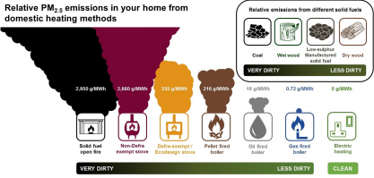
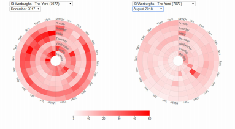
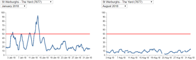

Pollution in the air we breathe has been a problem for many years. It is increasing, but so is awareness of the problem and the individual and political will to find solutions. 

A group of us in the valley have been collecting data, and we wanted to share this information with our neighbours, not to point fingers, apportion blame or demand action, but to provide clear information so that everyone can make informed decisions. 

<!--more-->

There is overwhelming evidence of the dangers of particulate matter (PM) in the air and its causes. Bristol City Council is taking this seriously with the diesel ban/clean air zone. However, the evidence is clear that solid fuel burning is a major cause of the most dangerous, very tiny particles that get into our lungs and bloodstream and cause multiple health problems from lung and heart diseases to dementia and strokes. 

In the St Werburghs valley, it’s clear from the charts on the back page that we have a problem during winter, and the data suggests that this is due to burning solid fuels. Many of us installed woodburners believing that they were an environmentally friendly heat source. The uncom fortable truth is that all woodburners, solid fuel stoves and open fires are bad for our health and bad for our neighbour’s health. 

In our valley our air pollution is exacerbated by the bowl shape which causes a temperature inversion which traps the smoke in the valley. Our PM2.5 levels regularly exceed the rest of Bristol. 

As you can see from the chart below, there are measures we can take to reduce the pollution if we continue to burn solid fuels: 

- Dry wood is the least polluting (2-3 years drying) 
- The hotter the fire, the cleaner it burns (and the cleaner your chimney.) Damp or green wood, or a fire left to burn slowly over night causes the most pollution. 
- All woodburning produces dangerous PM pollution, but a ‘clean burn’ compliant woodburner produces less. 
- Burning treated wood adds poisonous gasses to the PM pollution we breathe 
- The temperature inversion that traps polluted air in the valley is at its worst on cold, windless days. It’s cleaner to burn solid fuels on windy days. 

## Particulate Air Pollution Defra - Emissions From Solid Fuel 

This chart has its limits - it’s only concerned with air locally. Clearly electricity is only as clean as the means we use to produce it!

It’s clear from these charts that we have an air quality probem in winter, and that levels of pollution rise at times when traffic is low. The air smells of coal, tar, and woodsmoke when the pollution levels rise. 

## Air quality in the valley - Summer vs Winter

The red line is the WHO ‘do not breach’ limit, and is not the target, but simply when the air is dangerously unhealthy to breathe - and we regularly breach it, sometimes by a factor of two.

## Best/Worst times of the week

These charts were built from sensors in The Yard so we know the data is local to our area. If you would like more information and data sources for this information please email: e.m.c.yard@gmail.com